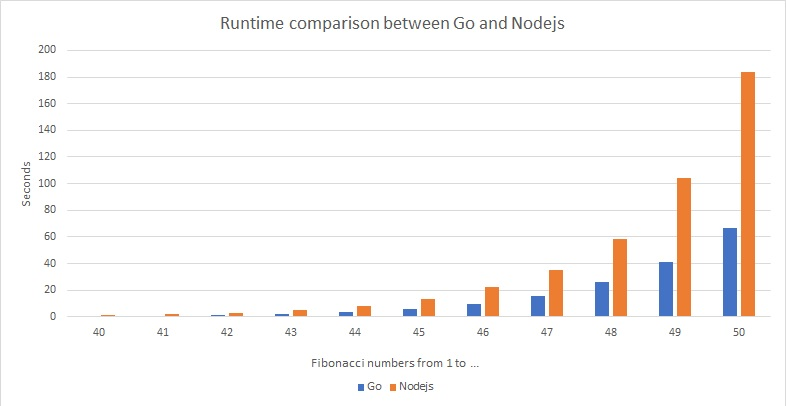

# performance-go-vs-node
I wanted to make a performance test between Go and Nodejs. I have written two similiar programs (one in Go and one in Nodejs) to calculate fibonacci numbers from 0 to x and I 
measured the execution times. I ran the programs one a 4-core CPU. Nodejs is single threaded and therefore much slower then Go. The results were as excepted.

